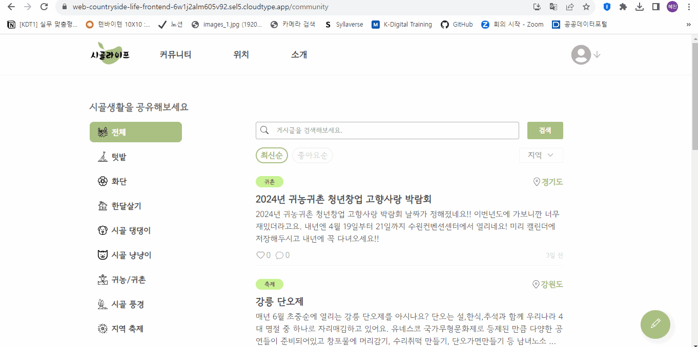

# 👨‍🌾 시골라이프 (개인 프로젝트)

**시골라이프**는 시골에서 생활하고 있는 사람들 뿐만 아니라, 미래에 시골 생활을 꿈꾸는 사람들을 위한 커뮤니티 중심의 플랫폼으로, 시골에서의 삶과 정보를 공유하는 공간입니다.

## 🔗 링크

- 시골라이프 **실 배포 사이트** 👉 [배포 사이트 링크](https://web-countryside-life-frontend-6w1j2alm605v92.sel5.cloudtype.app/community)
- 아래와 같이 **상세 정보**를 얻고 싶다면? 👉 [Notion 링크](https://lean-henley-aba.notion.site/81454fba78c6432ab45f8b0549f18316?pvs=4)
  - 시골라이프 소개
  - 주요 페이지 및 기능 소개
  - 기획 및 설계
  - 이슈 및 해결 과정
  - 배운점 및 느낀점
- **BackEnd** Github Repository 👉 [백엔드 코드 저장소](https://github.com/hyejinny97/Countryside-Life-Backend)

## 🧩 주요 페이지 소개

### 1️⃣ 커뮤니티 페이지

### 2️⃣ 위치 페이지

## 🎯 학습 목표

### 🔹 Front-end

- **React**를 사용해 재사용 가능한 component를 만드는 법을 익히기
- **SCSS**을 사용해 스타일링하는 법을 익히기
- **Redux-Toolkit, React-Redux** 라이브러리를 사용해 전역 상태 관리 방법을 익히기
- **Redux-Toolkit Query** 모듈을 사용해 서버와 통신하는 법을 익히기
- **React-Router** 라이브러리를 사용해 SPA(Single Page Application)을 구현하기
- **Responsive** Application을 구현하기

### 🔹 Back-end

- **Django**를 사용해 파이썬을 기반으로 한 서버 만들기
- **DRF**를 사용해 REST API 서버 만들기
- ERD 설계
- Postman으로 **API 명세서** 작성하기

## 🔧 사용한 기술 스택

### 🔹 Front-end

JS, React, React-Router, Redux, Redux-Toolkit Query, SCSS

### 🔹 Back-end

Python, Django, DRF
